# 🚀 GitOps-Based Kubernetes Deployment using ArgoCD

## 📌 Project Overview

This project demonstrates a **GitOps-based CI/CD pipeline** for deploying applications on Kubernetes using **ArgoCD**.
All deployments are managed through Git — **no manual kubectl changes** are allowed in production.

---

## 🎯 Objective

* Containerize application using Docker
* Deploy on Kubernetes cluster
* Use ArgoCD to monitor Git repository
* Automatically sync changes to cluster

---

## 🛠️ Tech Stack

* 🐳 Docker
* ☸️ Kubernetes (Minikube / EKS)
* 🔄 ArgoCD
* 📂 GitHub

---

## 🏗️ Architecture Flow

1. Developer pushes code to GitHub
2. Docker image is built and pushed to registry
3. Kubernetes manifests are updated in Git
4. ArgoCD monitors repo
5. ArgoCD automatically syncs and deploys changes to cluster

---

## 📦 Project Structure

```
.
├── Dockerfile
├── app/
├── k8s/
│   ├── deployment.yaml
│   ├── service.yaml
├── argocd/
│   ├── application.yaml
├── README.md
```

---

## ⚙️ Setup Instructions

### 1️⃣ Clone Repository

```
git clone <your-repo-url>
cd <repo-name>
```
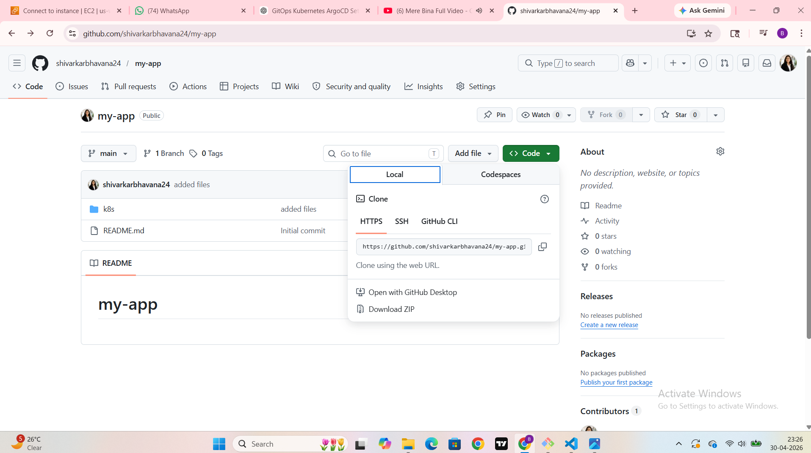

### 2️⃣ Build & Push Docker Image

```
docker build -t <docker-username>/my-app .
docker push <docker-username>/my-app
```
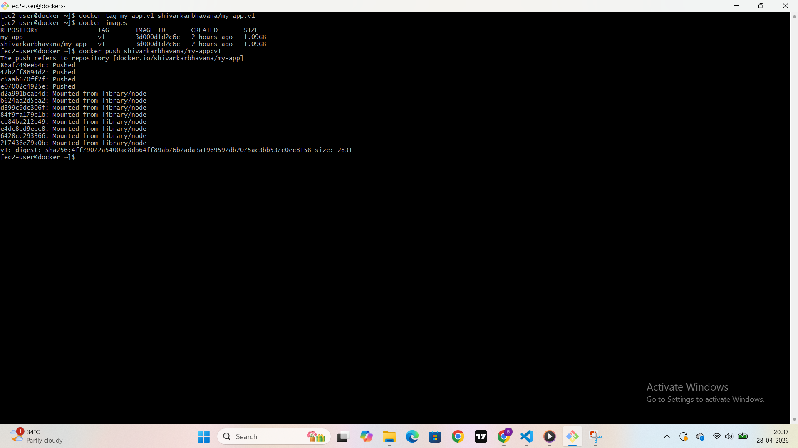

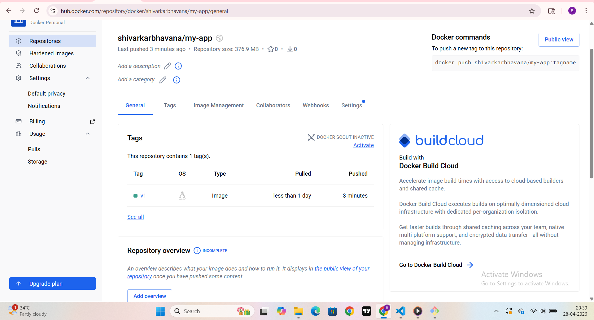

### 3️⃣ Kubernetes Deployment


kubectl apply -f k8s/deployment.yaml

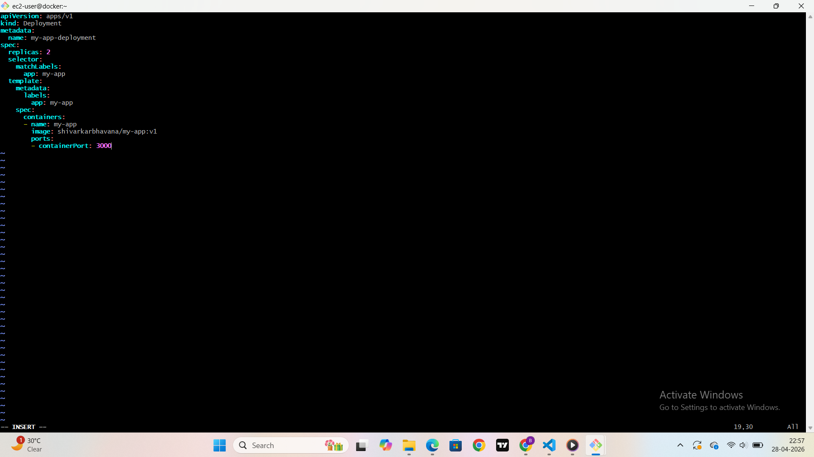

kubectl apply -f k8s/service.yaml

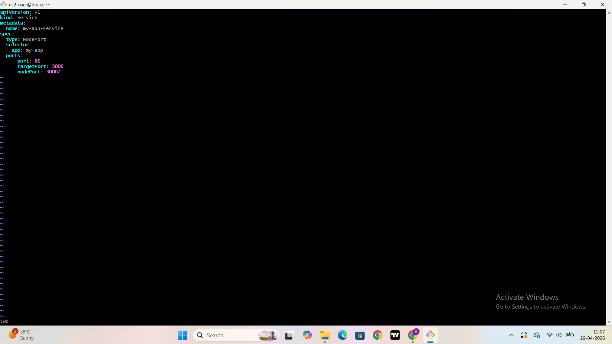

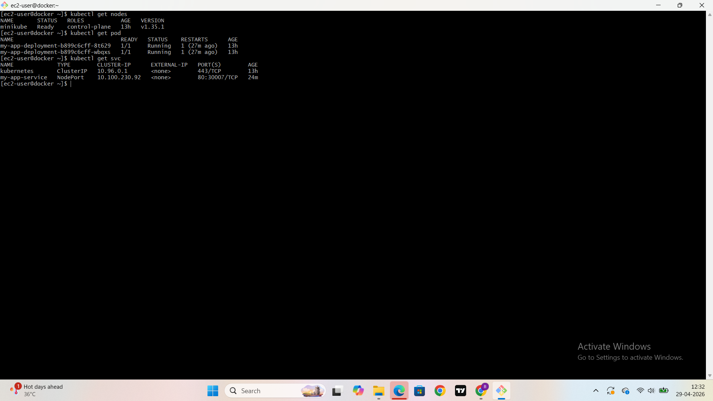

---

## 🚀 ArgoCD Setup

### Install ArgoCD

```
kubectl create namespace argocd
kubectl apply -n argocd -f https://raw.githubusercontent.com/argoproj/argo-cd/stable/manifests/install.yaml
```

### Access ArgoCD UI

```
kubectl port-forward svc/argocd-server -n argocd 8080:443
```

### Login

* Username: admin
* Password:

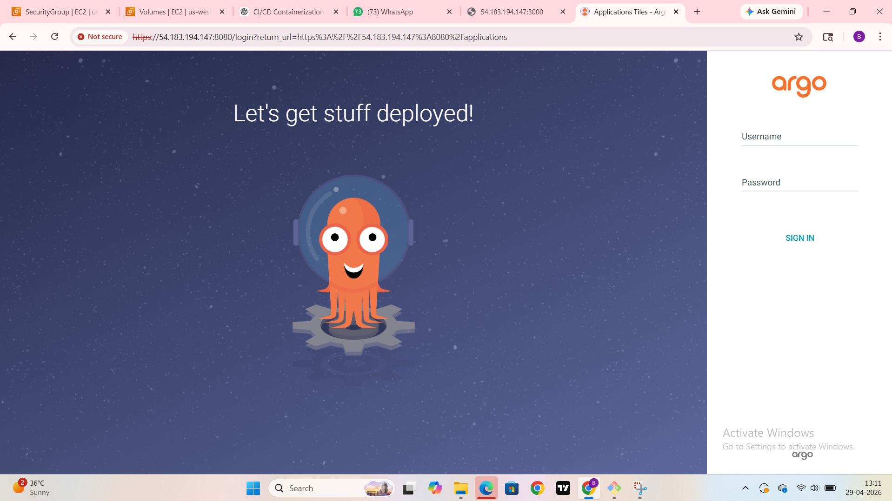

```
kubectl -n argocd get secret argocd-initial-admin-secret -o jsonpath="{.data.password}" | base64 --decode
```

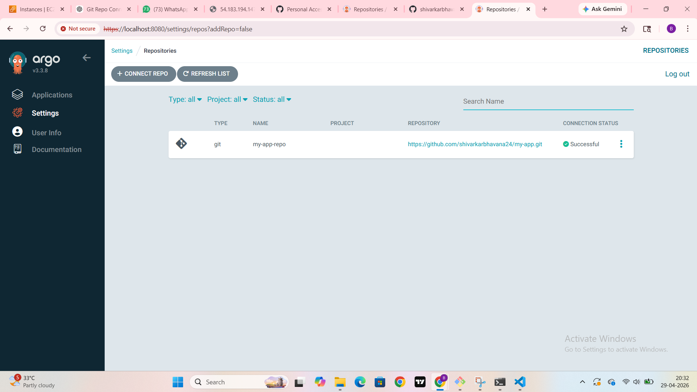

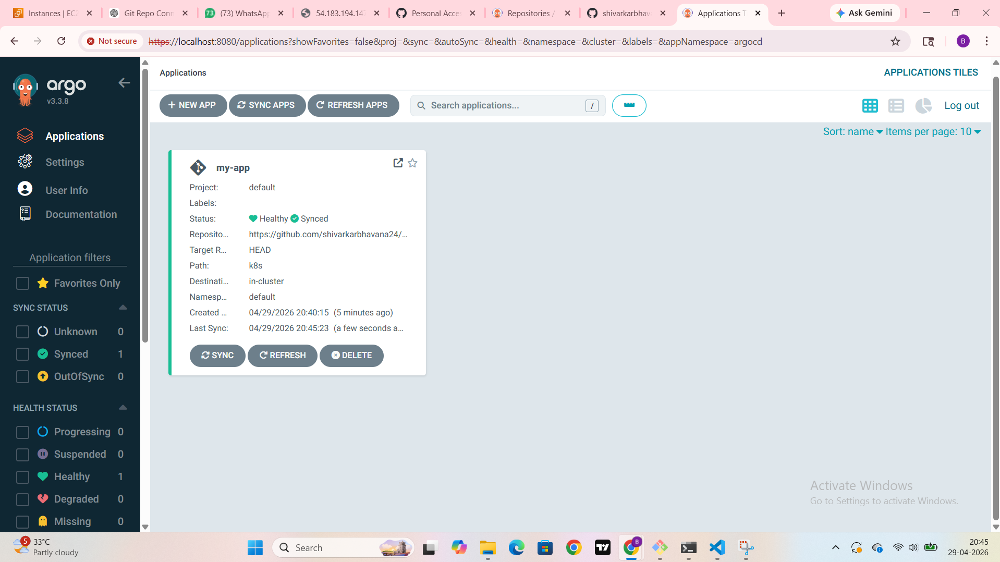

---

## 🔄 GitOps Workflow

1. Modify Kubernetes YAML (e.g., image version)
2. Commit & push changes:

```
git add .
git commit -m "update image version"
git push
```
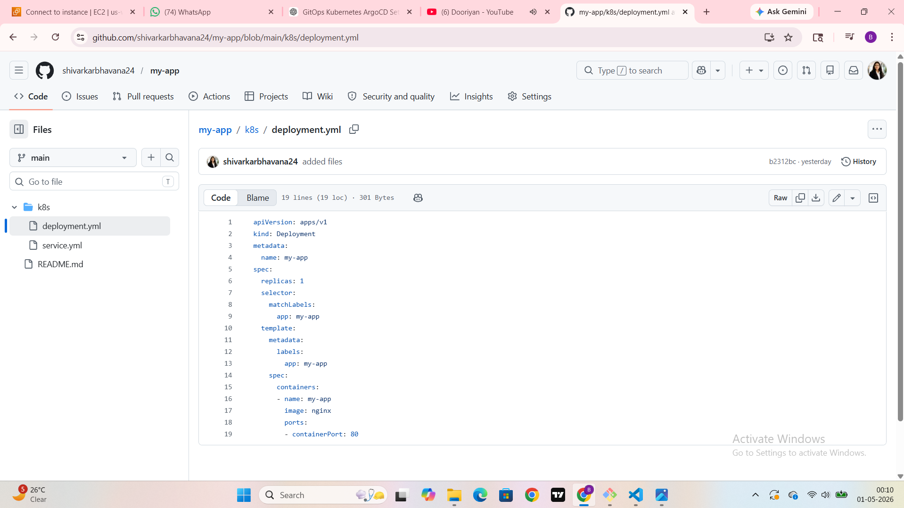

3. ArgoCD detects changes

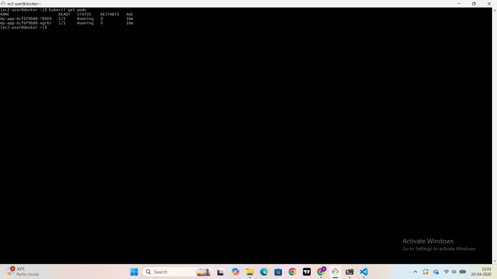


4. Auto-sync deploys new version


---

## ⚡ Optional Enhancements

* Helm Charts for templating
* Ingress for external access
* HPA (Horizontal Pod Autoscaler)

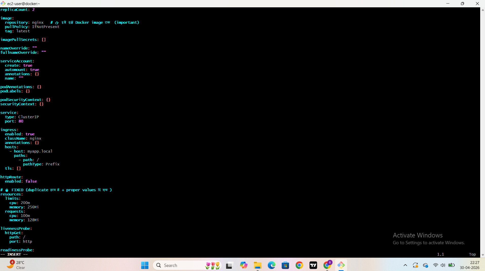

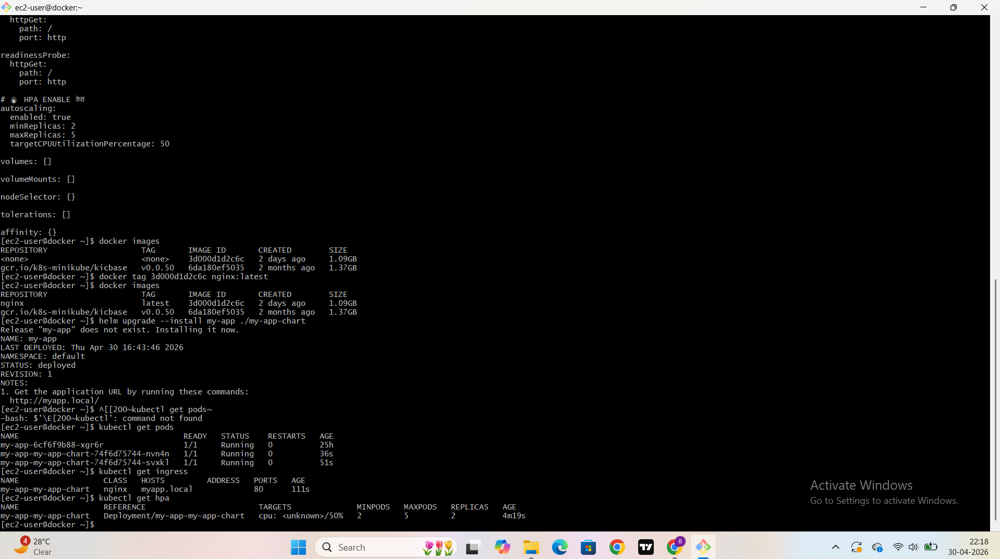

---

## 📖 Conclusion

This project ensures **fully automated, Git-driven deployments**, improving reliability, traceability, and consistency using GitOps principles with ArgoCD.

---
